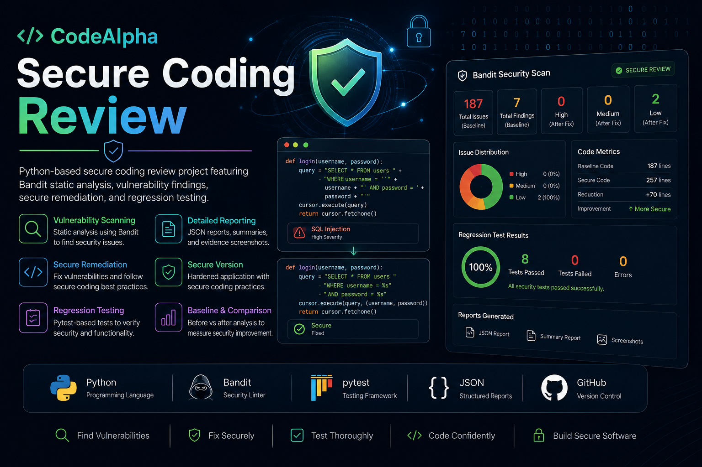

# CodeAlpha Secure Coding Review

<p align="center">
  
</p>

A Python-based **secure coding review and remediation project** developed for the **CodeAlpha Cyber Security Internship, Task 3**.

The project demonstrates an end-to-end security review workflow using a deliberately vulnerable Python application, manual source inspection, **Bandit static analysis**, documented security findings, secure remediation, and automated regression testing.

> **Educational use only:** The vulnerable target is intentionally insecure and must remain local. Do not deploy it or expose it to untrusted users.

---

## Table of Contents

- [Project Overview](#project-overview)
- [Objective](#objective)
- [Security Review Workflow](#security-review-workflow)
- [Key Findings](#key-findings)
- [Technology Stack](#technology-stack)
- [Project Structure](#project-structure)
- [Requirements](#requirements)
- [Installation](#installation)
- [Running the Vulnerable Target](#running-the-vulnerable-target)
- [Running the Bandit Baseline](#running-the-bandit-baseline)
- [Secure Version](#secure-version)
- [Regression Testing](#regression-testing)
- [Evidence Screenshots](#evidence-screenshots)
- [Reports](#reports)
- [CodeAlpha Task 3 Mapping](#codealpha-task-3-mapping)
- [Security and Ethical Use](#security-and-ethical-use)
- [Project Status](#project-status)
- [Author](#author)
- [License](#license)

---

## Project Overview

This project compares an intentionally vulnerable Python application with a separately implemented secure reference version.

```text
┌──────────────────────────────────────┐
│     Controlled Vulnerable Target     │
│        target_app/vulnerable_app.py  │
└──────────────────┬───────────────────┘
                   │
                   ▼
        Manual Source Inspection
                   +
          Bandit Static Analysis
                   │
                   ▼
          Security Findings
                   │
                   ▼
            Risk Assessment
                   │
                   ▼
          Secure Remediation
                   │
                   ▼
┌──────────────────────────────────────┐
│       Secure Reference Version       │
│        secure_version/secure_app.py  │
└──────────────────┬───────────────────┘
                   │
                   ▼
          Automated Regression Tests
```

The vulnerable application is retained as an **audit artifact** so that the before-and-after security differences remain clear and reproducible.

---

## Objective

The objective of CodeAlpha Task 3 is to perform a practical secure-coding review by:

1. Selecting a language and application to audit.
2. Identifying security weaknesses through manual review.
3. Using static analysis to support the review.
4. Documenting findings and their security impact.
5. Recommending secure coding practices.
6. Implementing corresponding remediation.
7. Testing the secure implementation.
8. Preserving evidence and documentation for reproducibility.

This repository implements that workflow using Python.

---

## Security Review Workflow

```text
1. Build controlled vulnerable application
                    ↓
2. Inspect source code manually
                    ↓
3. Run Bandit baseline scan
                    ↓
4. Review and classify findings
                    ↓
5. Document security risks
                    ↓
6. Implement secure reference version
                    ↓
7. Run regression/security tests
                    ↓
8. Preserve reports and screenshots
```

---

## Key Findings

The review identified **eight actionable security findings** through a combination of Bandit evidence and manual source inspection.

| ID | Finding | Evidence | Review Risk |
|---|---|---|---|
| SC-001 | Hard-coded application secret | Bandit B105 | Medium |
| SC-002 | Weak password hashing | Manual review | High |
| SC-003 | SQL injection in `create_user()` | Bandit B608 | High |
| SC-004 | SQL injection in `find_user()` | Bandit B608 | High |
| SC-005 | OS command injection | Bandit B602 | High |
| SC-006 | Path traversal | Manual review | Medium |
| SC-007 | Unsafe deserialization with `pickle` | Bandit B301/B403 | High |
| SC-008 | Plaintext password logging | Manual review | High |

Bandit also reports **B403** for importing `pickle` and **B404** for importing `subprocess`. These are treated as module-level advisories supporting the actionable findings rather than as separate vulnerabilities.

Detailed analysis is available in [`reports/FINDINGS.md`](reports/FINDINGS.md).

---

## Technology Stack

| Component | Technology |
|---|---|
| Programming Language | Python 3 |
| Static Security Analysis | Bandit 1.9.4 |
| Automated Testing | pytest 9.1.1 |
| Database | SQLite |
| Secure Password KDF | PBKDF2-HMAC-SHA256 |
| Serialization | JSON |
| Version Control | Git / GitHub |
| Documentation | Markdown |

---

## Project Structure

```text
CodeAlpha_SecureCodingReview/
│
├── reports/
│   ├── bandit_report.json
│   ├── FINDINGS.md
│   ├── REMEDIATION.md
│   └── SECURITY_REVIEW.md
│
├── screenshots/
│   ├── 00_project_banner.png
│   ├── 01_project_structure.png
│   ├── 02_bandit_baseline.png
│   ├── 03_security_findings.png
│   ├── 04_secure_remediation.png
│   ├── 05_tests_passed.png
│   └── README.md
│
├── secure_version/
│   ├── __init__.py
│   └── secure_app.py
│
├── target_app/
│   ├── __init__.py
│   └── vulnerable_app.py
│
├── tests/
│   └── test_security.py
│
├── tools/
│   └── run_review.py
│
├── .gitignore
├── LICENSE
├── README.md
└── requirements.txt
```

### Directory Responsibilities

- `target_app/` contains the deliberately vulnerable application used for the audit.
- `secure_version/` contains the remediated reference implementation.
- `tests/` contains automated regression/security tests.
- `tools/` contains the helper script for generating the Bandit baseline.
- `reports/` contains review documentation and the machine-readable Bandit evidence.
- `screenshots/` contains visual evidence from the review workflow.

---

## Requirements

- Python 3.10+
- pytest 9.1.1
- Bandit 1.9.4

The recorded environment used for verification was Python 3.13.15.

---

## Installation

From the project root:

```powershell
python -m pip install -r requirements.txt
```

Verify pytest:

```powershell
python -m pytest --version
```

Verify Bandit:

```powershell
python -m bandit --version
```

---

## Running the Vulnerable Target

The target application is intentionally vulnerable and is included only for controlled security-review practice.

Run it locally:

```powershell
python target_app\vulnerable_app.py
```

The application should **not** be deployed, exposed to a network, or used with untrusted input.

---

## Running the Bandit Baseline

Run the static analysis against the vulnerable target:

```powershell
python -m bandit -r target_app
```

To generate the machine-readable JSON report:

```powershell
python -m bandit -r target_app -f json -o reports\bandit_report.json
```

Or use the project helper:

```powershell
python tools\run_review.py
```

### Recorded Baseline

The latest recorded Bandit baseline scanned **187 lines of code** and reported:

```text
High:    1
Medium:  3
Low:     3
Total:   7
```

The seven Bandit findings consist of the actionable scanner results documented in the review. The two module-level advisories, B403 and B404, are separately explained in `FINDINGS.md`.

The baseline is intentionally non-clean because `target_app/` is deliberately vulnerable.

---

## Secure Version

The secure implementation is located at:

```text
secure_version/secure_app.py
```

It demonstrates the corresponding defensive coding practices.

### Secrets

The application secret is loaded from an environment variable instead of being embedded in source code:

```text
CODEALPHA_APP_SECRET
```

### Password Storage

Passwords are protected with:

```text
PBKDF2-HMAC-SHA256
```

using a random salt and a configured work factor.

### Database Access

User-controlled values are passed through parameterized SQLite queries using placeholders rather than SQL string interpolation.

### Command Execution

Command execution is restricted to an explicit allowlist and uses:

```text
shell=False
```

with a timeout.

### File Access

User-supplied filenames are resolved and checked to ensure the final path remains inside the approved data directory.

### Deserialization

The vulnerable `pickle` loading path is replaced with JSON-based serialization/deserialization.

### Logging

Passwords and authentication secrets are not written to application logs.

---

## Secure-Version Bandit Verification

Running Bandit against the secure reference:

```powershell
python -m bandit -r secure_version
```

The recorded result was:

```text
Total lines of code: 257

Undefined: 0
Low:       2
Medium:    0
High:      0
```

The remaining two **Low** findings are Bandit's B404 module-level advisory for importing `subprocess` and B603 for a `subprocess` call without shell interpretation.

These do **not** indicate that the original `shell=True` command-injection vulnerability remains. The secure implementation uses an explicit command allowlist, `shell=False`, and a timeout.

---

## Regression Testing

Run the automated security/regression suite:

```powershell
python -m pytest -q
```

### Verified Result

```text
8 passed
```

The tests verify:

- salted PBKDF2 password hashing
- password verification
- different salts for repeated password hashing
- parameterized database operations
- JSON serialization/deserialization
- path traversal rejection
- command allowlisting
- execution of an approved command
- valid JSON export

A successful test run demonstrates that the secure reference implementation satisfies the project's regression checks.

---

## Evidence Screenshots

The repository contains visual evidence documenting the major stages of the security review.

### 1. Project Structure

Shows the organized repository structure, including the vulnerable target, secure version, tests, reports, tools, and evidence directories.


### 2. Bandit Baseline

Shows the Bandit baseline scan against the intentionally vulnerable target.


### 3. Security Findings

Shows the documented finding register containing the eight actionable review findings.


### 4. Secure Remediation

Shows the secure implementation of key remediation controls including environment-based secrets, PBKDF2 password hashing, parameterized SQL, and allowlisted command execution.


### 5. Regression Tests

Shows the successful automated test execution with:

```text
8 passed
```


The screenshot evidence index is available in [`screenshots/README.md`](screenshots/README.md).

---

## Reports

### Security Findings

[`reports/FINDINGS.md`](reports/FINDINGS.md)

Contains:

- finding register
- Bandit evidence
- CWE references
- security impact
- review risk
- recommendations
- remediation references

### Remediation Report

[`reports/REMEDIATION.md`](reports/REMEDIATION.md)

Contains:

- remediation matrix
- secure coding practices applied
- verification approach
- regression-test information

### Security Review

[`reports/SECURITY_REVIEW.md`](reports/SECURITY_REVIEW.md)

Contains:

- review scope
- methodology
- CodeAlpha Task 3 alignment
- baseline analysis
- final findings
- verification
- conclusion

### Bandit JSON Evidence

[`reports/bandit_report.json`](reports/bandit_report.json)

Contains the machine-readable Bandit baseline generated from the vulnerable target.

---

## CodeAlpha Task 3 Mapping

| CodeAlpha Task 3 Requirement | Project Implementation |
|---|---|
| Select a language and application to audit | Python controlled vulnerable application |
| Perform a security review | Manual source inspection |
| Use static analysis or manual inspection | Bandit 1.9.4 + manual review |
| Identify vulnerabilities | Eight actionable findings |
| Assess security risk | Finding-level review risk |
| Provide recommendations | Documented remediation recommendations |
| Implement secure coding practices | Separate secure reference implementation |
| Verify remediation | pytest regression/security suite |
| Document the review | Findings, remediation, and review reports |
| Preserve evidence | Bandit JSON and screenshot evidence |

---

## Security and Ethical Use

This repository is an educational secure-coding exercise.

The vulnerable application is intentionally insecure and must remain within a controlled local environment.

Only perform security testing on applications, systems, networks, and data that you own or have explicit authorization to assess.

Do not deploy the vulnerable target as a production application.

Do not use the project to access, modify, monitor, or interfere with systems belonging to other users.

---

## Project Status

```text
Controlled vulnerable target       ✅
Manual security review             ✅
Bandit baseline analysis           ✅
Security findings documented       ✅
Secure reference implementation    ✅
Regression/security tests          ✅ 8 passed
Secure-version Bandit re-scan      ✅
Review documentation               ✅
Evidence screenshots               ✅
GitHub repository                  ✅ Published
```

### Completion Summary

The technical implementation and verification for **CodeAlpha Cyber Security Internship Task 3** are complete.

The repository preserves the vulnerable target as an audit artifact, documents the security weaknesses, provides a separate secure implementation, records static-analysis evidence, and verifies the secure implementation with automated tests.

---

## Author

**Subhadeep Adhikary**

Cyber Security Intern, CodeAlpha

---

## License

This project is licensed under the **MIT License**.

See [`LICENSE`](LICENSE) for the complete license text.
