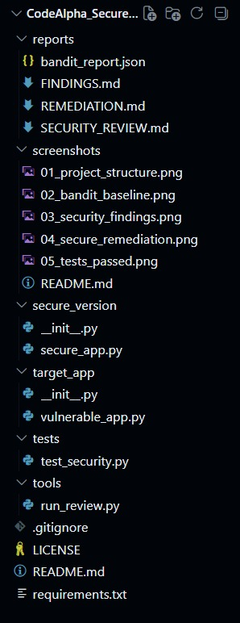
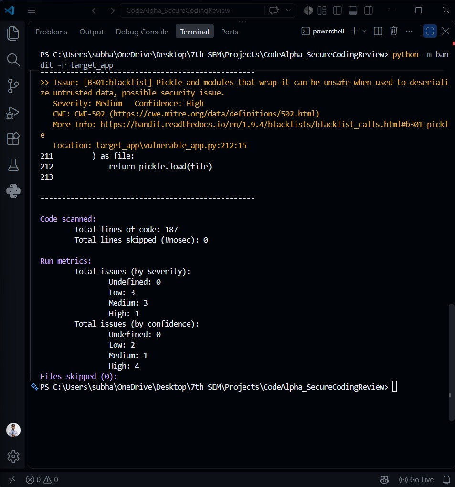
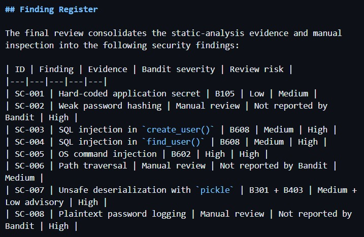
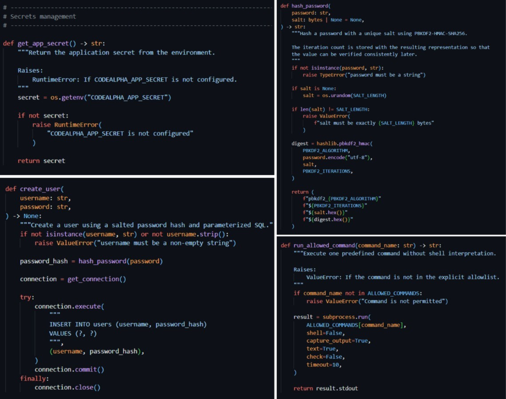
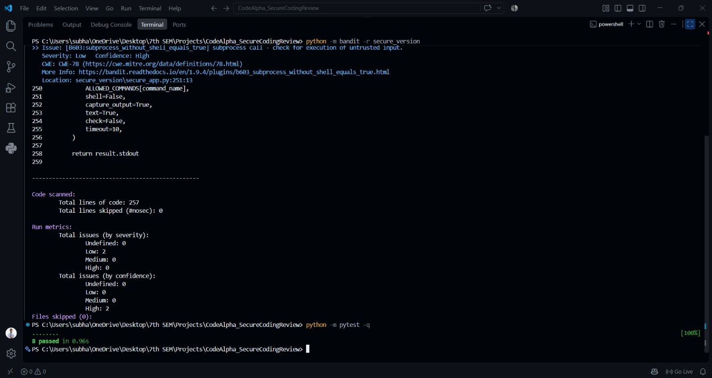

# CodeAlpha Secure Coding Review

A Python-based **secure coding review and remediation project** developed for the **CodeAlpha Cyber Security Internship, Task 3**.

This project demonstrates an end-to-end secure-coding workflow using a deliberately vulnerable local Python application, manual source inspection, **Bandit static analysis**, documented security findings, a separate secure reference implementation, and automated regression testing.

> **Educational and authorized use only:** The vulnerable application is intentionally insecure and exists solely as a controlled local audit target. Do not deploy it to production or expose it to untrusted users or networks.

---

## Table of Contents

- [Project Overview](#project-overview)
- [Objective](#objective)
- [Workflow](#workflow)
- [Key Security Areas](#key-security-areas)
- [Project Structure](#project-structure)
- [Requirements](#requirements)
- [Installation](#installation)
- [Running the Project](#running-the-project)
- [Baseline Security Scan](#baseline-security-scan)
- [Security Findings](#security-findings)
- [Secure Version](#secure-version)
- [Verification and Testing](#verification-and-testing)
- [Evidence Screenshots](#evidence-screenshots)
- [Reports](#reports)
- [CodeAlpha Task 3 Mapping](#codealpha-task-3-mapping)
- [Security and Ethical Use](#security-and-ethical-use)
- [Project Status](#project-status)
- [Author](#author)
- [License](#license)

---

## Project Overview

The project follows a practical **before-and-after secure-coding review model**.

A deliberately vulnerable Python application is inspected to identify insecure implementation patterns. The identified issues are assessed, documented, and remediated in a separate secure reference implementation. Both the vulnerable and remediated versions are then verified with static analysis and automated tests.

```text
target_app/vulnerable_app.py
            |
            | Manual review + Bandit
            v
      Security findings
            |
            | Remediation
            v
secure_version/secure_app.py
            |
            | Verification
            v
      Bandit re-scan + pytest
```

Keeping the two implementations separate preserves the vulnerable code as a reproducible audit artifact while making the remediated coding practices easy to compare.

---

## Objective

The main objectives are to:

1. Review a controlled Python application for common secure-coding weaknesses.
2. Combine **manual source inspection** with **Bandit static analysis**.
3. Document security findings with evidence, impact, risk, recommendations, and remediation.
4. Implement safer alternatives in a dedicated secure reference implementation.
5. Re-scan the remediated implementation.
6. Validate important controls through automated regression tests.
7. Preserve the complete review evidence for reproducibility.

---

## Workflow

```text
Controlled Vulnerable Application
                |
                v
        Manual Code Review
                +
        Bandit Static Analysis
                |
                v
         Security Findings
                |
                v
          Risk Assessment
                |
                v
         Secure Remediation
                |
                v
          Bandit Re-scan
                |
                v
       Security Regression Tests
```

---

## Key Security Areas

The review focuses on:

- Application secrets and configuration
- Password hashing and credential storage
- SQL query construction
- Operating-system command execution
- File and path handling
- Unsafe deserialization
- Sensitive authentication logging
- Security regression testing

---

## Project Structure

```text
CodeAlpha_SecureCodingReview/
│
├── reports/
│   ├── bandit_report.json
│   ├── FINDINGS.md
│   ├── REMEDIATION.md
│   └── SECURITY_REVIEW.md
│
├── screenshots/
│   ├── 01_project_structure.png
│   ├── 02_bandit_baseline.png
│   ├── 03_security_findings.png
│   ├── 04_secure_remediation.png
│   ├── 05_tests_passed.png
│   └── README.md
│
├── secure_version/
│   ├── __init__.py
│   └── secure_app.py
│
├── target_app/
│   ├── __init__.py
│   └── vulnerable_app.py
│
├── tests/
│   └── test_security.py
│
├── tools/
│   └── run_review.py
│
├── .gitignore
├── LICENSE
├── README.md
└── requirements.txt
```

Generated local artifacts such as `__pycache__/`, `.pytest_cache/`, virtual environments, SQLite databases, and log files are excluded by `.gitignore`.

---

## Requirements

- Python 3.10+
- pytest 9.1.1
- Bandit 1.9.4

The verified environment used for the final review was:

```text
Python:  3.13.15
pytest:  9.1.1
Bandit:  1.9.4
```

Dependencies are pinned in `requirements.txt`.

---

## Installation

From the project root:

```powershell
python -m pip install -r requirements.txt
```

Verify the installed tools:

```powershell
python -m pytest --version
python -m bandit --version
```

Expected versions:

```text
pytest 9.1.1
bandit 1.9.4
```

---

## Running the Project

### Run the vulnerable target

The vulnerable target is intended only for controlled local review:

```powershell
python target_app\vulnerable_app.py
```

It initializes the local demonstration database and identifies itself as the intentionally vulnerable target.

> **Warning:** Never deploy the vulnerable target as a production application or expose it to untrusted users.

### Run the review helper

The repository includes a helper script that runs the Bandit baseline scan and writes the machine-readable report:

```powershell
python tools\run_review.py
```

### Run the regression tests

```powershell
python -m pytest -q
```

Verified result:

```text
8 passed
```

---

## Baseline Security Scan

The baseline scan is performed against the deliberately vulnerable target.

### Run Bandit

```powershell
python -m bandit -r target_app
```

### Generate the machine-readable report

```powershell
python -m bandit -r target_app -f json -o reports\bandit_report.json
```

The report is stored at:

```text
reports/bandit_report.json
```

### Verified baseline

The final verified Bandit 1.9.4 scan reported:

```text
Lines of code scanned: 187

High:   1
Medium: 3
Low:    3
Total:  7

Errors: 0
Files skipped: 0
```

### Baseline findings

| Bandit ID | Description | Severity | Confidence |
|---|---|---|---|
| B403 | `pickle` module import advisory | Low | High |
| B404 | `subprocess` module import advisory | Low | High |
| B105 | Possible hard-coded secret/password | Low | Medium |
| B608 | Possible SQL injection in `create_user()` | Medium | Low |
| B608 | Possible SQL injection in `find_user()` | Medium | Low |
| B602 | `subprocess` call with `shell=True` | High | High |
| B301 | Unsafe `pickle.load()` deserialization | Medium | High |

### Interpreting B403 and B404

B403 and B404 are **module-level advisories**. Their presence alone does not prove that a vulnerability is exploitable.

The actionable issues are:

- unsafe `pickle.load()` usage, documented as **SC-007**
- `subprocess` execution with `shell=True`, documented as **SC-005**

They are therefore preserved as scanner evidence rather than counted as separate standalone vulnerabilities in the final manual finding register.

---

## Security Findings

The combined Bandit and manual review identified **8 actionable security findings**:

| ID | Finding | Evidence | Review Risk |
|---|---|---|---|
| SC-001 | Hard-coded application secret | B105 + manual review | Medium |
| SC-002 | Weak password hashing | Manual review | High |
| SC-003 | SQL injection in `create_user()` | B608 + manual review | High |
| SC-004 | SQL injection in `find_user()` | B608 + manual review | High |
| SC-005 | OS command injection | B602 + manual review | High |
| SC-006 | Path traversal | Manual review | Medium |
| SC-007 | Unsafe deserialization with `pickle` | B301 + B403 + manual review | High |
| SC-008 | Plaintext password logging | Manual review | High |

For full evidence, impact analysis, recommendations, and remediation references, see:

[`reports/FINDINGS.md`](reports/FINDINGS.md)

---

## Secure Version

The remediated reference implementation is:

```text
secure_version/secure_app.py
```

It demonstrates:

- Environment-based application secret loading
- Salted PBKDF2-HMAC-SHA256 password hashing
- Stored iteration count for password verification
- Constant-time password comparison with `hmac.compare_digest()`
- Parameterized SQLite queries
- Explicit command allowlisting
- `shell=False` for subprocess execution
- Command execution timeout
- Resolved-path containment validation
- JSON instead of `pickle`
- Credential-safe logging
- Input validation for security-sensitive operations

The secure implementation is intentionally kept separate from the vulnerable target to preserve a clear before-and-after comparison.

---

## Verification and Testing

### Secure-version Bandit scan

Run:

```powershell
python -m bandit -r secure_version
```

Verified result:

```text
Lines of code scanned: 257

High:   0
Medium: 0
Low:    2
Files skipped: 0
```

The remaining Low findings are:

```text
B404  subprocess import advisory
B603  subprocess usage with shell=False
```

The original High-severity `B602` finding caused by `shell=True` is no longer present.

The secure implementation also uses a fixed command allowlist and a timeout. The remaining Low advisories are documented rather than hidden or suppressed.

### Security regression tests

Run:

```powershell
python -m pytest -q
```

Verified result:

```text
8 passed
```

The regression suite covers:

- Password hashing and verification
- Random salting
- Parameterized database operations
- JSON serialization and deserialization
- Path traversal rejection
- Command allowlisting
- Allowlisted command execution
- Valid JSON output

---

## Before-and-After Results

| Measure | Vulnerable Target | Secure Version |
|---|---:|---:|
| Lines scanned | 187 | 257 |
| High Bandit findings | 1 | 0 |
| Medium Bandit findings | 3 | 0 |
| Low Bandit findings | 3 | 2 |
| Regression tests | N/A | 8 passed |

The most significant Bandit findings were removed by the secure implementation. The remaining Low findings are documented subprocess advisories associated with the controlled use of `subprocess` and `shell=False`.

---

## Evidence Screenshots

The repository includes five screenshots documenting the major stages of the review:

### 1. Final Project Structure



### 2. Bandit Baseline Scan



### 3. Security Findings



### 4. Secure Remediation



### 5. Final Verification



See [`screenshots/README.md`](screenshots/README.md) for the evidence index and descriptions.

---

## Reports

The project includes the following reports:

- [`reports/SECURITY_REVIEW.md`](reports/SECURITY_REVIEW.md)  
  Review scope, methodology, baseline analysis, risk interpretation, remediation overview, and verification.

- [`reports/FINDINGS.md`](reports/FINDINGS.md)  
  Detailed security finding register, evidence, impact, recommendations, and remediation references.

- [`reports/REMEDIATION.md`](reports/REMEDIATION.md)  
  Remediation matrix, secure-coding controls, implementation changes, verification, and reproducibility.

- [`reports/bandit_report.json`](reports/bandit_report.json)  
  Machine-readable Bandit baseline evidence generated from the vulnerable target.

---

## CodeAlpha Task 3 Mapping

| CodeAlpha Task 3 activity | Project implementation |
|---|---|
| Select a programming language | Python |
| Select an application to audit | `target_app/vulnerable_app.py` |
| Perform a security review | Manual source inspection |
| Use static analysis | Bandit 1.9.4 |
| Identify vulnerabilities | Eight-item security finding register |
| Provide recommendations | Finding-level secure-coding recommendations |
| Implement remediation | `secure_version/secure_app.py` |
| Verify remediation | Bandit re-scan + pytest |
| Document findings and remediation | `reports/` documentation |
| Provide supporting evidence | `screenshots/` evidence package |

---

## Security and Ethical Use

This repository is an educational secure-coding exercise.

The intentionally vulnerable application exists only to demonstrate the security-review and remediation process. It must not be deployed as-is.

Only assess systems, applications, networks, or data that you own or have explicit authorization to test.

Do not use the vulnerable target to access, modify, or interfere with systems belonging to other users.

---

## Project Status

```text
Vulnerable target application       ✅
Manual security review              ✅
Bandit baseline scan                ✅
Baseline JSON evidence              ✅
Security findings documented        ✅
Secure remediation                  ✅
Secure-version Bandit re-scan       ✅
Security regression tests           ✅ 8 passed
Evidence screenshots                ✅ 5 files
GitHub repository upload            ✅
CodeAlpha submission form           ⏳
LinkedIn project video              ⏳
```

**Technical implementation, security review, remediation, verification, evidence collection, and GitHub upload are complete.**

The remaining items are the external CodeAlpha submission form and LinkedIn project video.

---

## Author

**Subhadeep Adhikary**

Cyber Security Intern - CodeAlpha

---

## License

This project is licensed under the MIT License.

See [`LICENSE`](LICENSE) for the complete license text.
